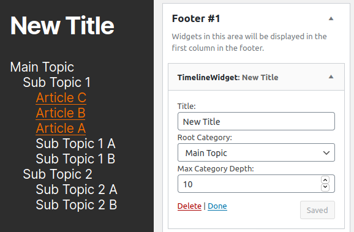

# timeline-menu

A wordpress standalone plugin widget 
to display a tree map of a specific category tree.

Features:
- Configurable max depth ( -1 == unlimited )
- Selectable root category

Future features:
- Ability to select styling
- Options to make nodes foldable (hide a branch)
- Options to ignore sub categories
- Options to sort categories and posts
